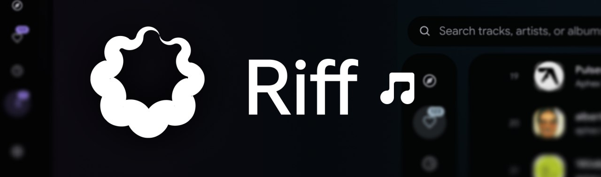
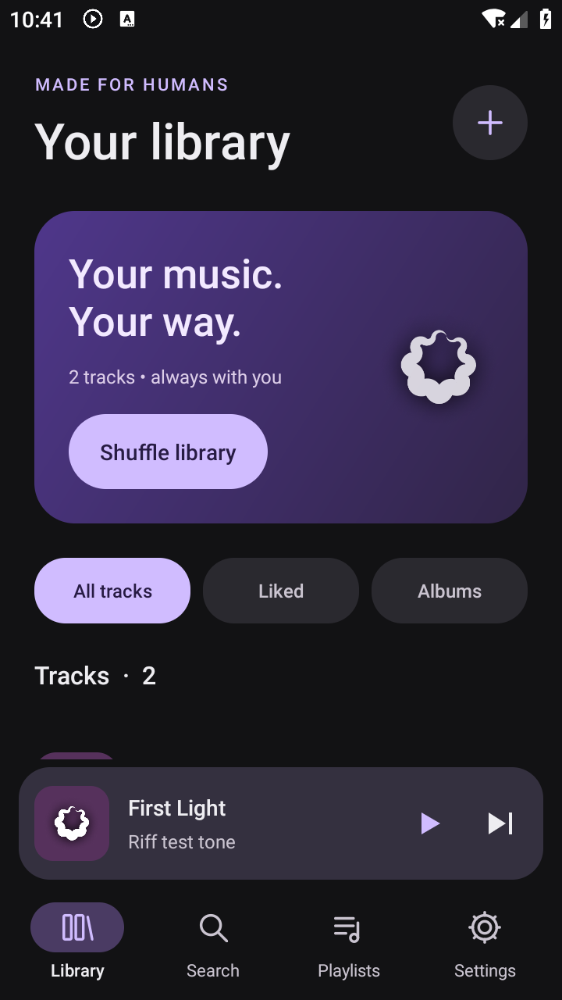
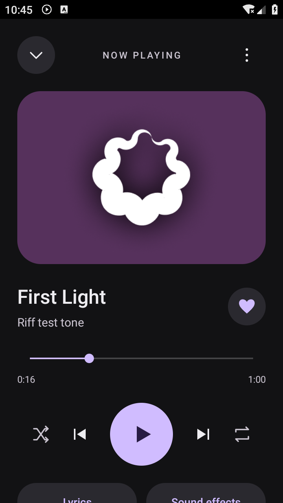
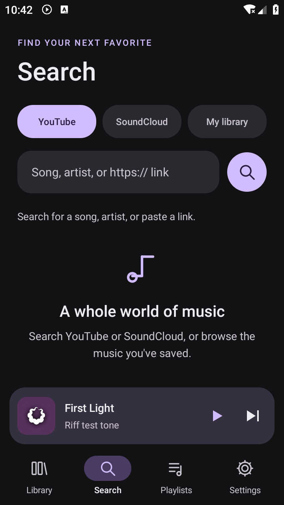

<p align="center">
  
</p>

<h1 align="center">Riff for Android</h1>

<p align="center">
  Your music. Your way.<br>
  A native Android music player with an offline library, background playback, lyrics and audio tools.
</p>

<p align="center">
  <a href="https://github.com/aidentallen/riff-android/actions/workflows/android.yml"></a>
  
  
  <a href="android/LICENSE"></a>
</p>

<p align="center">
  <a href="https://github.com/aidentallen/riff-android/releases/download/android-v1.0.0-preview/riff-android.apk"><strong>Download Android APK</strong></a>
  · <a href="https://github.com/aidentallen/riff-android/releases/tag/android-v1.0.0-preview">All downloads</a>
  · <a href="android/README.md">Android development guide</a>
  · <a href="https://github.com/aidentallen/riff-android/issues">Report an issue</a>
</p>

This community Android port brings much of [rootscripts/Riff](https://github.com/rootscripts/riff)'s desktop feature set to your phone. It runs on the device using native Android views and AndroidX Media3. No account, subscription or desktop server is needed for local playback. The complete original Electron desktop project is also included in this repository.

## A look inside

<table>
  <tr>
    <td align="center"><strong>Your library</strong></td>
    <td align="center"><strong>Now playing</strong></td>
    <td align="center"><strong>Search</strong></td>
  </tr>
  <tr>
    <td></td>
    <td></td>
    <td></td>
  </tr>
</table>

Screenshots use generated test audio. The installed app starts with an empty library.

## What you can do

| Feature | On Android |
| --- | --- |
| **Keep music offline** | Import files or folders, browse albums, edit library details and favorite tracks. |
| **Find and download tracks** | Search YouTube and SoundCloud, open supported links, stream, or download MP3, M4A, FLAC, Opus and WAV using bundled yt-dlp and FFmpeg. |
| **Listen in the background** | Media notifications, lock-screen and headset controls, audio focus and unplug-to-pause. |
| **Make it your queue** | Playlists, play next, queue editing, shuffle, repeat and playback-position restoration. |
| **Follow the lyrics** | LRCLIB lookup, offline cache, LRC import, synced highlighting, tap-to-seek and manual timing. |
| **Shape the sound** | Speed and pitch, equalizer, bass boost, echo, distortion and reverb. |
| **Make quick edits** | Trim a local track to a separate MP3; export or share audio. |
| **Make it yours** | Four accent colors, sleep timer and an in-app download-engine update. |

See the [feature comparison](android/README.md#features) for desktop differences. Discord Rich Presence, desktop recommendations, waveform editing and word-level lyrics have not been ported.

## Install on your phone

1. Download [**riff-android.apk**](https://github.com/aidentallen/riff-android/releases/download/android-v1.0.0-preview/riff-android.apk) for most modern phones. Choose the [**universal APK**](https://github.com/aidentallen/riff-android/releases/download/android-v1.0.0-preview/riff-android-universal.apk) for older ARMv7 devices or x86_64 emulators.
2. Open the APK and allow your browser or file manager to install apps when Android prompts you.
3. Open **Library → +** to import music, or use **Search** to find a track. Allow notifications to see playback and download controls.

**Requires Android 8.0 or newer.** This first release is a debug-signed preview for personal testing. It is not a Play Store build. [Release checksums](https://github.com/aidentallen/riff-android/releases/download/android-v1.0.0-preview/SHA256SUMS.txt) are provided alongside the downloads.

Imported and downloaded music lives in private app storage. Uninstalling Riff removes that library and its data; use **Export audio** or **Share audio** to save copies elsewhere.

## Build the Android app

Use **JDK 17**, Android SDK **35**, and the included Gradle wrapper. Android Studio can open the `android/` directory directly.

```sh
git clone https://github.com/aidentallen/riff-android.git
cd riff-android/android

sdkmanager "platform-tools" "platforms;android-35" "build-tools;35.0.0"
# Set ANDROID_HOME, or add sdk.dir=/your/android/sdk to local.properties.
./gradlew :app:assembleDebug :app:lintDebug :app:testDebugUnitTest
```

On Windows, use `gradlew.bat`. APKs are written to `android/app/build/outputs/apk/debug/`:

| APK | Devices |
| --- | --- |
| `app-arm64-v8a-debug.apk` | Most modern Android phones |
| `app-armeabi-v7a-debug.apk` | Older 32-bit ARM devices |
| `app-x86_64-debug.apk` | x86_64 emulators and devices |
| `app-universal-debug.apk` | All three architectures |

The first build downloads dependencies. For signing and device-test instructions, see the [Android guide](android/README.md#build).

## Desktop source

The repository also contains the original Windows and Linux Electron music player, based on upstream revision [`b2a0834`](https://github.com/rootscripts/riff/commit/b2a0834). Its desktop features include downloads, playlists, lyrics, audio editing, media keys and Discord Rich Presence.

To run it from source with Node.js 22 and npm:

```sh
cd riff-android
npm ci
npm start
```

Use `npm run dist -- --publish never` to package the desktop app locally. Desktop `yt-dlp`, `ffmpeg` and `ffprobe` can be supplied in `bin/` or on `PATH`; see [bin/README.txt](bin/README.txt). The Android app bundles its own tools separately. Upstream desktop releases remain available at [rootscripts/riff/releases](https://github.com/rootscripts/riff/releases).

## Project map

```text
riff-android/
├── android/                    Native Android app, Gradle wrapper and tests
│   ├── app/src/main/           Player, UI, library, lyrics and download services
│   ├── app/src/test/           Audio processing and LRC unit tests
│   ├── app/src/androidTest/    Device integration tests
│   └── VALIDATION.md           Build results and tested behavior
├── docs/screenshots/           Real Android app previews
├── .github/workflows/          Android CI and upstream desktop release workflow
├── main.js, preload.js         Electron desktop process and bridge
├── app.js, index.html          Desktop UI
├── audio-engine.js             Desktop audio processing
├── assets/                    Original Riff branding and desktop dependencies
└── LICENSE                    Original desktop MIT license
```

## Tested, and still being tested

The Android preview passed APK builds, lint with **zero errors**, **6 unit tests**, APK signature checks and **3 device integration checks** on Android 9. Device checks covered import, playlists, lyrics caching, background playback, seeking, native yt-dlp execution and FFmpeg trimming.

Live YouTube/SoundCloud extraction, online lyrics, downloads on a physical phone and device-specific native effects still need end-to-end verification. Online services may change or reject requests; **Settings → Download engine** updates yt-dlp. Native effect support varies by device. Full results are recorded in [android/VALIDATION.md](android/VALIDATION.md).

## Contributing and credits

Bug reports and improvements are welcome. Start with [CONTRIBUTING.md](CONTRIBUTING.md), and include your Android version, device architecture and steps to reproduce a problem.

Riff's original desktop code, branding and icon are by [rootscripts](https://github.com/rootscripts). This is an unofficial community port, not an upstream Android release.

- **Desktop source and original assets:** [MIT](LICENSE).
- **New Android port:** [GPL-3.0-or-later](android/LICENSE), with upstream MIT attribution preserved in [android/UPSTREAM-LICENSE](android/UPSTREAM-LICENSE).
- **Android dependencies and source links:** [Third-party notices](android/THIRD_PARTY_NOTICES.md), also available inside the app under **About → Licenses**.
